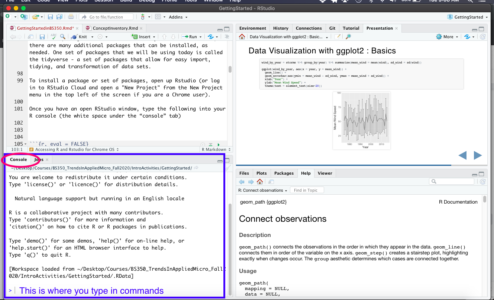

```{r setup, include=FALSE}
knitr::opts_chunk$set(echo = TRUE)
```

## What are Git, Github, and Github Desktop
**Git** is a *version-control* system that is free and open-source. Version control allows users to track changes in code and documents and revert back to older versions of the document. These functionalities also help to coordinate work among teams - different people can contribute changes to the same code or document and Git will track who changed what and when. If a change is made and the team does not want to keep the resulting code after the change, they can revert to an earlier version. Git is an industry-standard tool that is used by many companies and labs.

**Github** is a web-based user interface for Git, allowing people to store their code and projects in an accessible way. We will work with a part of Github called Github classroom to distribute, track, and collect assignments. 

**Github Desktop** is a guided-user interface (GUI) that lets people perform git tasks via clicking an interface, rather than coding from the command line. We will be using Github Desktop to perform version control using git.

## Installing Github Desktop

1. For all operating systems (MacOS, Windows, or Chrome) : 
Create a Github account at https://github.com/

*  For more information about this process: https://git-scm.com/book/en/v2/GitHub-Account-Setup-and-Configuration  
*  *Note - there is no need to configure SSH access, so skip the SSH steps in the protocol*

***Steps 2+3 are only for those with MacOS and Windows :*** 

2. Install Github Desktop using information here : https://docs.github.com/en/desktop/getting-started-with-github-desktop/installing-github-desktop

3. Authenticate your github account on Github Desktop, following directions here :
https://docs.github.com/en/desktop/getting-started-with-github-desktop/authenticating-to-github

4. Read a bit more about Git, here :  

 * Git introduction : https://guides.github.com/introduction/git-handbook/  
 * Git workflow - forking : https://guides.github.com/activities/forking/

*It's okay if these readings seem a bit foreign - we'll practice with Git and Github Desktop quite a bit, and it will only be a short while before this process feels natural*

## What are R and RStudio?
* R is a flexible and powerful statistics and visualization system. 
* RStudio is an integrated development environment (IDE) for R, allowing for :
    +  Code editing 
    +  Debugging
    +  Ability to see plots and datasets 
    +  Access to code history 
    +  Reproducible analysis and workspace management 

## Why R and RStudio?
* Flexible and powerful statistics and visualization software
* Reproducible data analysis
* Does not cost anything (freeware)
    + Huge community of help, troubleshooting, learning
* Facilitates collaboration
* Adopted as key tool in many fields (graduate school, industry, data science)


## Downloading/Installing R and Rstudio for MacOS and Windows

To install and run Rstudio, base R needs to be installed first.

**Installing R**  

1. Navigate to https://cran.r-project.org/  

2. Click the "Download R for..." that matches your operating system.  

3. **If** Mac OS X :  
Click on the .pkg file relevant to your current OS (10.11 or higher vs. 10.9 or higher vs...)  
   **Else** :  
Click the blue highlighted "install R for the first time"  

4. After package download, standard installer package will run to walk through the installation. For Windows users, you may need to locate the file in your downloads and double click to run. 

**Installing RStudio** 

1. Navigate to https://www.rstudio.com/products/rstudio/download/#download  

2. Click "Download RStudio"   

3. Click "Download" under "RStudio Desktop Open Source License"  

4. Click on the Installer relevant to your operating system  

5. For MacOS users, installer should install RStudio automatically. For Windows users, you may need to locate the file in your downloads and double click to run. 

## Accessing R and Rstudio for Chrome OS

**If plan to use Chrome OS (ie. a chromebook) this semester and have not already let me know, please send me an email ASAP.**

1. Navigate to : https://rstudio.cloud/plans/free 

2. Sign up for Cloud Free by creating a username and password 

## Installing Packages

A package is a collection of code that allows specific functions to be carried out in R (ie. plotting, summarizing data, aligning sequences, etc.) R has base packages that come automatically installed. However, there are many additional packages that can be installed, as needed. One set of packages that we will be using today is called the tidyverse - a set of packages that allow for easy import, tidying, and transformation of data sets. 

To install a package or set of packages, open up Rstudio (or log in to RStudio Cloud and open a "New Project" from the New Project menu in the top left of the screen if you are a Chrome user).

Once you have an open RStudio window, type the following command into your R console (the white space under the “console” tab, see image below)


  
**Command for package installation:**
```{r, eval = FALSE}
install.packages(c("tidyverse", 'readr', 'mosaic')) 
#this will install a collection of packages called the 'tidyverse', as well as individual packages called 'readr' and 'mosaic'.
```

This download will take a little time, as we are downloading a collection of packages. We will use this collection of packages during the first week of our course!

To load a specific package for use, use the `library()` command in the console. For instance :
```{r, eval = FALSE}
library(ggplot2) 
#ggplot2 is a data visualization package we will use in the first week of the course
```


## **Optional reading + practice prior to starting the course** : 

### Overview of RStudio Console

You can run R in the R console, but RStudio has some aspects that are more user-friendly and functional. We will be running R in RStudio during this course. 

Once you open up RStudio, you will see four quadrants on your screen. 

**Bottom left quadrant of screen :**  

* *Console* - area where R code is input and output results are shown. Any code typed here is forgotten after the R session is closed. 

**Top left quadrant of screen :**  

* Location of files for code editing (R script, R Markdown). We will be working with these files during the first week of the course. You may not see this quadrant if you do not have an R file open. 


**Top right quadrant of screen :**  

* *Environment tab* - shows what is contained in your global environment (ex. what data files you've read in, variables that are named, etc.)  
    + Can click on this data to see dataset
    + Can import data via "Import Dataset"
    + The Broom icon clears objects from workspace (would need to re-load data)  
* *History tab* - shows the history of commands executed during the R session  
* *Connections* - connection to existing data sources/databases. Can be a collaborative tool.

**Bottom right quadrant of screen :**  

* *Files* - shows files contained in current working directory  
    + Can create new folder and delete or rename files     
    + 'More' provides additional options, including the setting of the working directory  
* *Plots* - visualizes plots from code
* *Packages* - list of packages that have been installed. Checkmarks indicate that the package is loaded for use in your R session. You can click on the box of the relevant package to load or unload it)  
* *Help* - displays documentation relevant to specific commands or packages.  
* *Viewer* - allows viewing of local web content (ex. web graphics generated by specific R packages)

### Creating a dataframe

Dataframes are easily created in R. A dataframe stores a table (two-dimensional array-like structure) in which each column contains values of one variable and each row contains one set of values for each column. 

Dataframes are built by typing something like this into the console :
```{r}
Name <- c("Ned", "Sally", "Georgette") 
```
Name is the first column. Ned, Sally, and Georgette are the values associated with the Name column. The type of variable used to represent name values is a "character". The `<-` symbol indicates that you are assigning the values of "Ned", "Sally", "Georgette" to the variable "Name". You can use the `<-` symbol and the `=` symbol interchangeably. 
```{r}
Height <- c(67, 60, 72)
```
Height is the second column. 67,60, 72 are the values associated with the Height column. As the first values of the first two columns correspond to the same row of data, 67 represents the height of Ned. The type of variable used to represent height values is a numeric. Numbers in R are generally treated as numeric (1.00), rather than integers (1), but you can explicitly specify a variable to be represented as integers : `Height = as.integer(c(67, 60, 72))`
```{r}
Vitamin <- c(TRUE, FALSE, TRUE) 
```
Vitamin (short for whether study participants take a multivitamin) is the third column. Again, the first value of this column corresponds to the first value of the other two columns - therefore, Ned does take a vitamin. The type of variable used to represent vitamin values is a logical. `True` or `False` are the only values a logical can take. 

```{r}
df = data.frame(Name, Height, Vitamin)
df
```
The `data.frame` function merges the different columns into a dataframe. 

#### Let's practice
 <mark>Practice creating a dataframe (no need to do the analysis) for the dataset below :</mark>

1. The following data are weights of food (kg) consumed per day by adult deer at different times of the year.  Test the null hypothesis that food consumption is the same for all months tested.  

  Feb: 4.7, 4.9, 5.0, 4.8, 4.7  
  May: 4.6, 4.4, 4.3, 4.4, 4.1, 4.2  
  Aug: 4.8, 4.7, 4.6, 4.4, 4.7, 4.8  
  Nov: 4.9, 5.2, 5.4, 5.1, 5.6

### Reading in / writing out datasets

If your dataset is already prepared in a file (ex. .xlsx, .csv, .sav, .dat, etc), it is quite easy to read the data into R, without needing to re-create the dataframe. 

#### Working directories and paths to data
Prior to reading in data, it helps to know where R will be looking for files to read in. All the other software on your computer does this as well (ex. you need navigate to the correct folder for attaching a file to your email), but the process is abstracted via clicking on folders/files. In R, the file path needs to be written out in code instead of clicking!

For instance, if I wanted to read in or load a file from my desktop, I would rype the absolute file path into the console : 
```{r, eval=FALSE}
"/Users/chantalkoechli/Desktop/Rcourse/arbuthnot.csv" 
```
Note that R will auto-fill the directory path. 

If you are on a Windows operating system, your path would be slightly different :
```{r, eval = FALSE}
"C:/Users/chantalkoechli/Desktop/FILENAME.csv"
```

This is an absolute file path because it directs R to the file from the root directory (the base directory/tree trunk of the computer file system). The symbol for the root directory is `/`. Thus, the file path above goes from the root directory, to the Users directory (contained within the root directory), to the chantalkoechli directory (contained within the Users directory), to the Desktop directory (contained within the chantalkoechli directory), to FILENAME.csv (contained within the Desktop directory). 

You can easily find filepaths for specific files by right-clicking the file and selecting "Get Info" or "Properties". 

Relative filepaths can also be provided, if your working directory is already set to a directory other than the root directory. For instance, my current working directory is `/Users/chantal.koechli/Desktop/Rcourse`, which can be seen as the Rcourse folder contained on my desktop. This means that R will look for files in my Rcourse directory, unless I tell it to look somewhere else. So I can type `example_data.csv`, and if example_data.csv exists in the Rcourse folder, R will find it. You can set your working directory under the "Files" tab, or using the command `setwd("/path/to/directory")`

Using absolute filepaths is the most foolproof method for reading files in, but using relative directories is faster. 

Now, we'll see how various files can be read into R. There's a handy walk-through in more detail, for more filetypes, here : https://www.datacamp.com/community/tutorials/r-data-import-tutorial

#### .txt files

```{r, eval = FALSE}
data <- read.table("/Users/chantalkoechli/Desktop/example.txt", header = TRUE)
```

To write out text files :
```{r, eval = FALSE}
write.table(x = data, file = "/Users/chantalkoechli/Desktop/example.txt")

#telling R to write the dataframe 'data' to the file 'example.txt', located in the path /Users/chantalkoechli/Desktop/
```

#### .csv files

```{r, eval = FALSE}
data <- read.csv("Users/chantalkoechli/Desktop/example.csv")
```

To write out .csv files :
```{r, eval = FALSE}
write.csv(x = data, file = "/Users/chantalkoechli/Desktop/example.csv")

#telling R to write the dataframe 'data' to the file 'example.csv', located in the path /Users/chantalkoechli/Desktop/
```

#### Excel files (.xls, .xlsx)

```{r, eval = FALSE}
library(xlsx) #you will need to install.packages('xlsx') if you don't already have this library installed.
data <- read.xlsx("Users/chantalkoechli/Desktop/example.xlsx")
```

To write out Excel files :
```{r, eval = FALSE}
write.xlsx2(x = data, file = "/Users/chantalkoechli/Desktop/example.xlsx", sheetName = "Sheet1")

#telling R to write the dataframe 'data' to Sheet 1 of the file 'example.xlsx', located in the path /Users/chantalkoechli/Desktop/

#Note, there is a write.xlsx() function that also uses the exact same syntax as write.csv2. The difference is in execution of the two commands - write.xlsx is much slower for spreadsheets > 100,000 cells. 
```

#### Files stored on Google Drive
```{r, eval = FALSE}
library(googledrive)
drive_download("data/mlb2016.csv", type = "csv")
data <-  read.csv("mlb2016.csv")
```
To upload files to googledrive 

```{r, eval = FALSE}
library(googledrive)

write.csv(x = data, file = "/Users/chantalkoechli/Desktop/mlb.csv")

drive_upload("/Users/chantalkoechli/Desktop/mlb.csv", 
             name = "mlb.csv",
             type = "spreadsheet")

```

#### Reading in files via URL (can also be used with Google Drive)
```{r}
my.url = "https://docs.google.com/spreadsheets/d/e/2PACX-1vSkaiah-LcTs1aBi--L6M0hQ5cfhn4zSMw50Oij1GEEsAy4_A-hWL4pUTlXNWz_y18pS948AJkJaR9P/pub?output=csv" 
# link from Google Drive after publishing data to web

data <- read.csv(url(my.url))
```

### General R helpful hints

* Avoid spaces in filenames and in naming variables
* In naming variables, `<-` operator is traditionally used in R. You can equivalently use `=` operator. 
* Read error messages - they often have good information!
* A `#` operator in front of words signifies to R to not run that code - this can be used for annotating code or for troubleshooting
* Following that, annotate your code! You may think you will remember what the code was for...you will not. Annotation will also help reinforce your coding knowledge and models best practices for data science. 

### Let's practice
<mark>Using one of the methods illustrated above, or outlined in the tutorial cited above, try loading at least three data files of interest into R from your computer. If you want to load in a file type that is not specified in any resources, ask Google. </mark>

### Troubleshooting
One of R's greatest strengths is that it is freeware and has an enormous community of users that help each other out. Using Google to troubleshoot an error message, an issue, or a "how do I..." is my main go-to.  

Stackoverflow is a Q&A site for programming and is also an excellent resource : https://stackoverflow.com/questions/tagged/r.

Finally, R itself is well documented. In the R console, using `?<package name/function/etc>` will bring up the relevant help file in the "Help" viewer. 


### Practice : RSwirl
To practice some of the basic functions of R, the package `swirl` offers a hands-on, guided practice. Just `install.packages("swirl")`, then load swirl through `library(swirl)` to begin. 
